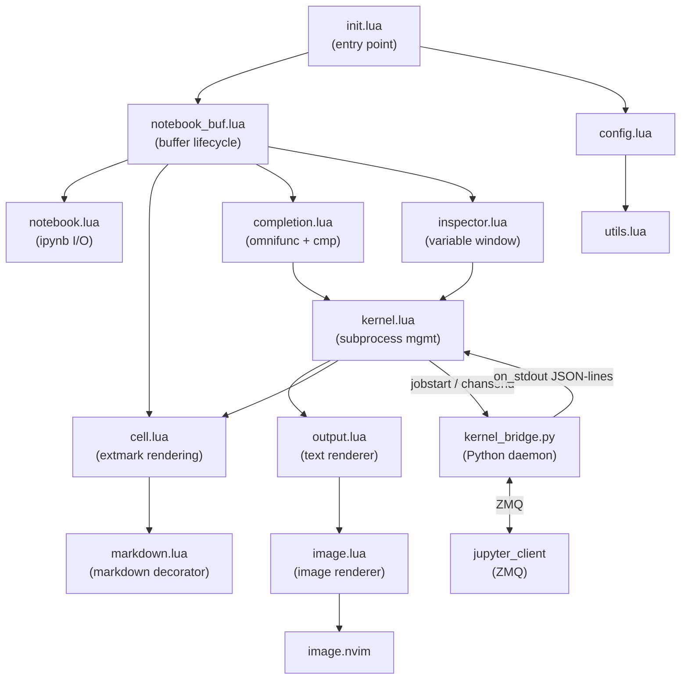
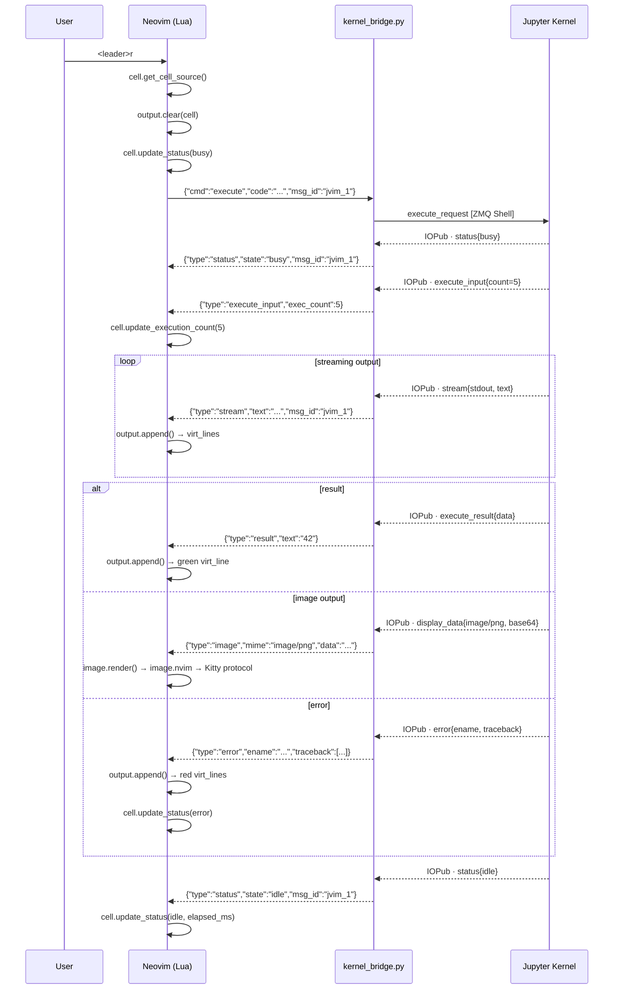

# jupytervim

A Neovim plugin that brings a **Google Colab-like Jupyter notebook experience**
directly into Neovim — with full Vim modal editing, Colab-style cell rendering,
inline kernel output, and image/plot rendering via the Kitty graphics protocol.

```
╭── [ python · [3] ─────────────────────────────────────────╮
  import numpy as np
  import matplotlib.pyplot as plt

  x = np.linspace(0, 2 * np.pi, 200)
  plt.plot(x, np.sin(x))
  plt.show()
╰── ✓ 0.42s ────────────────────────────────────────────────╯
  ···········································
  [sinusoidal plot rendered inline via Kitty protocol]
```

---

## Features

| Feature | Status |
|---|---|
| Open `.ipynb` files natively in Neovim | ✅ |
| Colab-style cell borders with language icon + execution count | ✅ |
| Full Vim modal editing (normal, insert, visual) inside cells | ✅ |
| Cell navigation (`]c` / `[c`) | ✅ |
| Add / delete cells | ✅ |
| Save back to `.ipynb` (nbformat 3 & 4) | ✅ |
| Jupyter kernel execution via ZMQ | ✅ |
| Inline `stdout` / `stderr` as virtual lines | ✅ |
| Inline error output with traceback | ✅ |
| Image / plot rendering (PNG, JPEG, SVG) | ✅ |
| Kitty graphics protocol via `image.nvim` | ✅ |
| `ueberzugpp` / sixel fallback | ✅ |
| Markdown cell rendering (H1–H4, bold, italic, links, code) | ✅ |
| Kernel completions (`<C-x><C-o>` + nvim-cmp source) | ✅ |
| Variable inspector (`:JupyterInspect` / `<leader>ji`) | ✅ |

---

## Requirements

### Neovim

- **Neovim 0.10+** — required for `virt_lines` extmarks
- [`nvim-treesitter`](https://github.com/nvim-treesitter/nvim-treesitter) — syntax highlighting inside cells

### Python

```bash
# The plugin manages its own venv via uv.
# On first use, run from the plugin directory:
uv sync --project python/

# Or install manually:
pip install jupyter_client nbformat ipykernel
```

### Optional — Image rendering

| Dependency | Purpose |
|---|---|
| [`3rd/image.nvim`](https://github.com/3rd/image.nvim) | Image rendering backend |
| **Kitty** terminal ≥ 0.28 | Kitty graphics protocol (best quality) |
| **Ghostty** or **WezTerm** | Also support Kitty protocol |
| `ueberzugpp` | Fallback for any X11/Wayland terminal |

### Optional — Richer Markdown

| Dependency | Purpose |
|---|---|
| [`render-markdown.nvim`](https://github.com/MeanderingProgrammer/render-markdown.nvim) | Rich markdown rendering in markdown cells |

---

## Installation

### lazy.nvim (recommended)

```lua
{
  "ansh-info/jupytervim",
  ft = "ipynb",
  dependencies = {
    "nvim-treesitter/nvim-treesitter",
    { "3rd/image.nvim", opts = {} },              -- optional: images
    { "MeanderingProgrammer/render-markdown.nvim", -- optional: markdown
      opts = {} },
    { "hrsh7th/nvim-cmp" },                        -- optional: completions
  },
  opts = {
    keymaps = {
      enabled          = true,
      run_cell         = "<leader>r",
      run_all_above    = "<leader>ra",
      run_all_below    = "<leader>rb",
      next_cell        = "]c",
      prev_cell        = "[c",
      add_cell_below   = "<leader>co",
      add_cell_above   = "<leader>cO",
      delete_cell      = "<leader>cd",
      interrupt_kernel = "<leader>ri",
    },
    ui = {
      show_execution_count = true,
      show_elapsed_time    = true,
      output_max_lines     = 50,   -- 0 = unlimited
    },
    image = {
      enabled  = true,
      backend  = "auto",   -- "kitty" | "ueberzug" | "sixel" | "auto"
      max_width  = 80,
      max_height = 20,
    },
    kernel = {
      default_kernel = "python3",
      auto_start     = true,      -- start kernel on first <leader>r
    },
    notebook = {
      auto_save = false,
    },
  },
}
```

### packer.nvim

```lua
use {
  "ansh-info/jupytervim",
  config = function()
    require("jupytervim").setup({})
  end,
}
```

---

## Quick Start

```
nvim my_notebook.ipynb      -- opens and renders the notebook
:JupyterKernelStart         -- start a Python kernel
<leader>r                   -- run the cell under the cursor
:JupyterInspect             -- view all variables in the kernel
```

---

## Keymaps

All keymaps are **buffer-local** — they only apply inside `.ipynb` buffers.

| Key | Mode | Action |
|---|---|---|
| `]c` | n | Next cell |
| `[c` | n | Previous cell |
| `<leader>r` | n/i | Run current cell |
| `<leader>ra` | n | Run all cells above cursor |
| `<leader>rb` | n | Run all cells below cursor |
| `<leader>ri` | n | Interrupt kernel |
| `<leader>co` | n | Add code cell below |
| `<leader>cO` | n | Add code cell above |
| `<leader>cd` | n | Delete current cell |
| `<leader>w` | n | Save notebook to disk |
| `<leader>ji` | n | Open variable inspector |
| `<leader>jh` | n | Show keymap help overlay |
| `<C-x><C-o>` | i | Kernel completions (omnifunc) |

---

## Commands

| Command | Description |
|---|---|
| `:JupyterOpen [path]` | Open a notebook in the current buffer |
| `:JupyterSave` | Save the current notebook to disk |
| `:JupyterKernelStart [name]` | Start a Jupyter kernel (`python3` default) |
| `:JupyterKernelStop` | Stop the kernel |
| `:JupyterKernelRestart` | Restart the kernel, clearing all output |
| `:JupyterKernelInterrupt` | Send interrupt signal (Ctrl-C equivalent) |
| `:JupyterKernelInfo` | Show kernel status floating window |
| `:JupyterRun` | Execute the cell under the cursor |
| `:JupyterRunAll` | Execute all cells in the notebook |
| `:JupyterRunAbove` | Execute all cells above cursor |
| `:JupyterCellAdd` | Add a code cell below current |
| `:JupyterCellDelete` | Delete the cell under cursor |
| `:JupyterInspect` | Open variable inspector |
| `:JupyterHelp` | Show keymap reference |

---

## Architecture

### File layout

```
jupytervim/
├── lua/jupytervim/
│   ├── init.lua          # Public API + BufReadCmd / BufWriteCmd autocmds
│   ├── config.lua        # Typed defaults + deep-merge user opts
│   ├── utils.lua         # Logging, file I/O, uid helpers
│   ├── notebook.lua      # .ipynb parse / serialise  (nbformat 3 & 4)
│   ├── notebook_buf.lua  # Buffer lifecycle: open, save, sync, cleanup
│   ├── cell.lua          # Cell rendering (extmarks), navigation, mutation
│   ├── keymaps.lua       # Buffer-local keymaps + help overlay
│   ├── commands.lua      # :Jupyter* user commands
│   ├── kernel.lua        # Kernel subprocess management + message routing
│   ├── output.lua        # Output chunk → virt_lines renderer
│   ├── image.lua         # image.nvim integration for PNG/JPEG/SVG output
│   ├── markdown.lua      # Markdown cell decorator (extmarks + concealing)
│   ├── completion.lua    # omnifunc + nvim-cmp source
│   ├── inspector.lua     # Variable inspector floating window
│   └── utils.lua         # Shared helpers
├── python/
│   ├── pyproject.toml    # uv project, Python 3.12
│   ├── uv.lock           # Reproducible lockfile
│   └── kernel_bridge.py  # ZMQ ↔ JSON-line stdio daemon
└── plugin/
    └── jupytervim.lua    # Auto-setup shim (VimEnter)
```

### Module dependency graph



### Execution protocol (sequence diagram)



### JSON-line protocol reference

**Neovim → kernel_bridge.py (stdin)**

| Command | Fields |
|---|---|
| `start` | `kernel: string` |
| `attach` | `connection_file?: string` |
| `execute` | `code: string`, `msg_id: string` |
| `complete` | `code: string`, `cursor_pos: int`, `msg_id: string` |
| `inspect` | `code: string`, `cursor_pos: int`, `msg_id: string` |
| `kernel_info` | — |
| `interrupt` | — |
| `shutdown` | — |

**kernel_bridge.py → Neovim (stdout)**

| Message type | Key fields |
|---|---|
| `status` | `state: "starting"\|"busy"\|"idle"`, `msg_id` |
| `stream` | `name: "stdout"\|"stderr"`, `text`, `msg_id` |
| `result` | `text`, `html`, `msg_id` |
| `image` | `mime: "image/png"\|"image/jpeg"\|"image/svg+xml"`, `data`, `msg_id` |
| `error` | `ename`, `evalue`, `traceback: string[]`, `msg_id` |
| `clear_output` | `msg_id` |
| `execute_input` | `code`, `exec_count`, `msg_id` |
| `complete` | `matches: string[]`, `cursor_start`, `msg_id` |
| `inspect` | `text`, `msg_id` |
| `kernel_info` | `language`, `version` |
| `error_internal` | `message` |

---

## Cell rendering model

```
                    ← buffer line (virt_line, above) →
╭── [ python · [5] ────────────────────────────────────╮
  import numpy as np                ← real buffer lines
  x = np.linspace(0, 10, 100)         (editable, vim modes)
  print(x.mean())
╰── ✓ 0.18s ───────────────────────────────────────────╯
                    ← output zone (virt_lines, below) →
  ···········································
  5.0                                        ← stream output
  ···········································
  [image rendered here via Kitty protocol]   ← image
```

The **buffer only contains raw source code**. All borders, status indicators,
and output are rendered via `nvim_buf_set_extmark` `virt_lines` — they do not
affect the file content and survive edits correctly because extmarks track
buffer positions automatically.

---

## Development Roadmap

| Phase | Status | Scope |
|---|---|---|
| **1** | ✅ Done | Notebook parser, cell renderer, navigation, save |
| **2** | ✅ Done | ZMQ kernel bridge, execution, inline text/error output |
| **3** | ✅ Done | Image rendering (PNG/JPEG/SVG via image.nvim) |
| **4** | ✅ Done | Markdown rendering, kernel completions, variable inspector |

---

## Contributing

PRs and issues welcome at https://github.com/ansh-info/jupytervim.

---

## License

MIT — see [LICENSE](LICENSE).
